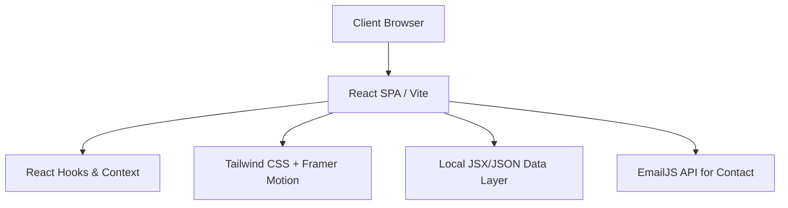
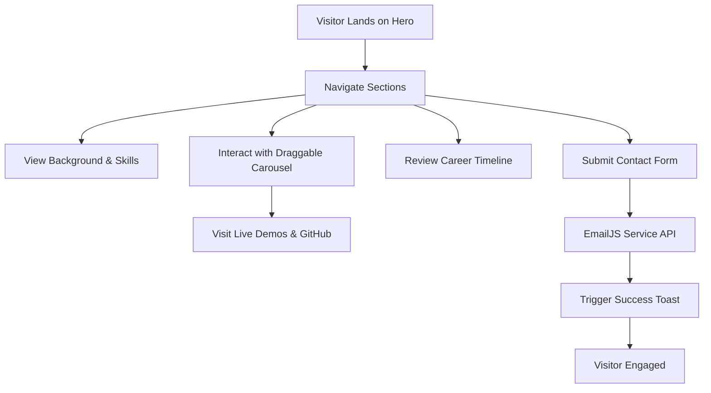
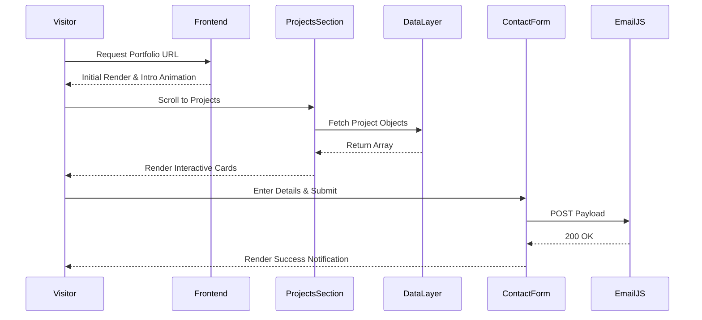
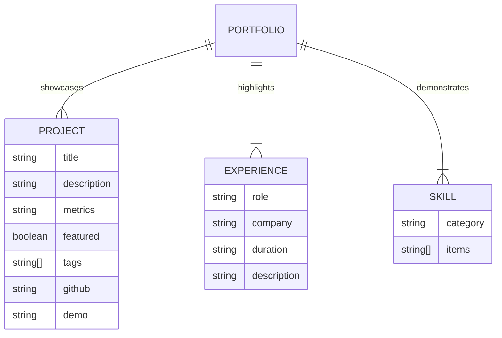
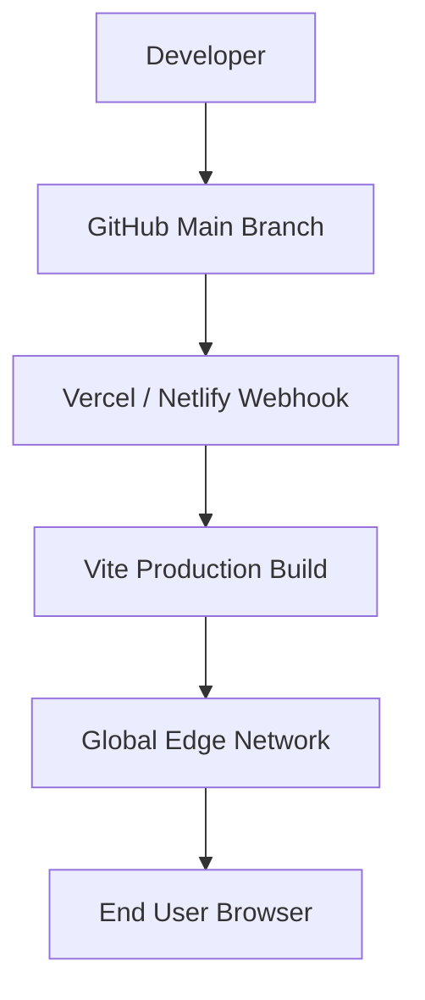

# 🚀 Rajkumar Anbazhagan - Premium Developer Portfolio

---

## 📖 Overview

**Problem:** Standard developer portfolios often lack the interactive flair, performance optimization, and architectural depth necessary to stand out to elite recruiters and senior engineering teams.
**Solution:** A meticulously crafted, high-performance React application leveraging modern glassmorphism UI, advanced Framer Motion animations, and clean component-driven architecture to showcase full-stack capabilities, enterprise projects, and real-world impact.
**Real-world Importance:** Acts as a 24/7 digital resume that not only lists skills but actively *demonstrates* frontend mastery, UI/UX sensibilities, and clean code practices.

---

## 🧠 System Architecture

### 📊 Architecture Diagram



### 🏗️ Explanation

- **Data Flow:** The application relies on a decoupled static data layer (`src/data/`) that acts as a local database, feeding component states seamlessly without network latency.
- **Client-Server Interaction:** Purely client-side for ultra-fast load times. Network requests are reserved for analytics, external assets, and form submissions (EmailJS).
- **Scaling Approach:** Delivered via global CDN (Content Delivery Network). Infinitely scalable as it consists of static assets generated at build time.

---

## 🔄 Application Flow

### 📌 Flowchart



---

## 🔁 Sequence Diagram



---

## 🧩 Module Breakdown

- **Hero & Navigation:** Typewriter effects, responsive mobile menu, dynamic anchor routing.
- **About & Education:** Bento-grid layouts, animated statistics, and background highlights.
- **Projects Showcase:** Draggable, physics-based carousel using Framer Motion with conditional rendering for repositories and live metrics.
- **Experience Timeline:** Vertical progression mapping of professional roles with interactive hover states.
- **Contact Module:** Controlled form components integrated with 3rd-party mailing API (EmailJS) and input validation.

---

## ✨ Features

- **Advanced Animations:** Scroll-triggered reveals, spring-physics drag interactions, and typewriter effects.
- **Modern UI Aesthetics:** Glassmorphism, tailored gradients, and meticulously designed Bento UI grids.
- **Responsive Architecture:** Flawless rendering from 320px mobile screens to 4K ultrawide displays.
- **Dynamic Content Rendering:** Projects conditionally display metrics, "Featured" badges, and action buttons only when relevant data exists.
- **Contact Automation:** Direct-to-email form submission without needing a custom backend server.

---

## 🧰 Tech Stack

**Frontend Framework: React.js (v18)**
- *Why used:* Component reusability and vast ecosystem.
- *How used:* Functional components, custom hooks, and state management.

**Build Tool: Vite**
- *Why used:* Blazing fast HMR (Hot Module Replacement) and optimized production builds.
- *How used:* Configured for SWC compilation and absolute path aliases.

**Styling: Tailwind CSS**
- *Why used:* Utility-first approach for rapid, consistent, and responsive styling.
- *How used:* Custom design tokens, complex gradient masking, and hover elevations.

**Animations: Framer Motion**
- *Why used:* Declarative, physics-based animations.
- *How used:* `useMotionValue`, viewport-triggered entrances, and drag constraints in the Project carousel.

**Form Handling: EmailJS**
- *Why used:* Serverless email dispatching.
- *How used:* Triggered on form submit with secure template mapping.

---

## 📂 Project Structure

```text
client/
├── public/                 # Static assets (images, icons)
├── src/
│   ├── assets/             # Internal assets
│   ├── components/
│   │   ├── layout/         # Navbar, Footer
│   │   ├── sections/       # Hero, About, Projects, Experience, Contact
│   │   └── ui/             # Reusable atomic UI (Buttons, Cards)
│   ├── data/               # Local database (projects.jsx, skills.jsx, etc.)
│   ├── hooks/              # Custom React hooks
│   ├── App.jsx             # Root component & Section orchestration
│   ├── index.css           # Global Tailwind directives & custom classes
│   └── main.jsx            # Application entry point
├── package.json
├── tailwind.config.js      # Theme customization
└── vite.config.js
```

---

## ⚙️ Installation & Setup

### 🖥️ System Requirements
- **Node.js:** v18.0+
- **OS:** Windows / macOS / Linux

### 🔧 Step-by-Step Setup

1. **Clone Repo**
   ```bash
   git clone https://github.com/rajkumar-tech-2002/project_portfolio.git
   cd project_portfolio/client
   ```

2. **Install Dependencies**
   ```bash
   npm install
   ```

3. **Environment Variables**
   Create a `.env` file in the `client` directory:
   ```env
   VITE_EMAILJS_SERVICE_ID=your_service_id
   VITE_EMAILJS_TEMPLATE_ID=your_template_id
   VITE_EMAILJS_PUBLIC_KEY=your_public_key
   ```

4. **Run Development Server**
   ```bash
   npm run dev
   ```

5. **Build for Production**
   ```bash
   npm run build
   ```

---

## 🔐 Security & Restrictions

- **Data Protection:** Form inputs are sanitized natively by React (XSS prevention).
- **Environment Security:** EmailJS API keys are prefixed with `VITE_` but restricted via the EmailJS dashboard to authorized domains only.
- **Spam Prevention:** Easily extensible to include reCAPTCHA within the EmailJS payload.

---

## 🗄️ Database Design (Data Structure)

Since this is a high-performance serverless portfolio, it utilizes structured static JSON/JSX arrays.

### 📊 ER Diagram



### 🧾 Explanation
- The architecture treats static data objects as a database, cleanly separating content from UI components. This mimics a real backend integration and makes future CMS migration trivial.

---

## 🚀 DevOps & Deployment

### ⚙️ Deployment Diagram



- **CI/CD Pipeline:** Fully automated. Pushes to the `main` branch trigger a new deployment.
- **Hosting Strategy:** Deployed as a static site on a CDN for zero-downtime, infinite scalability, and sub-second load times worldwide.

---

## 📈 Scalability & Performance

- **Load Handling:** CDN caching guarantees immediate TTFB (Time to First Byte).
- **Optimization:** Vite builds are minified, chunked, and CSS is purged of unused classes via Tailwind. Images should be served as WebP.
- **React Optimization:** Strict component isolation prevents unnecessary re-renders during complex Framer Motion animations.

---

## 🧹 Project Optimization सुझाव (Improvements)

During the deep analysis of the codebase, the following production-level optimizations were identified to make the project even cleaner:

1. **Remove Unused Dependencies:**
   - Your `package.json` contains massive UI libraries like `@radix-ui/*`, `@react-three/fiber`, `three`, `recharts`, `zod`, and `react-hook-form`.
   - *Action:* If these are not being utilized in your current UI (which primarily uses Tailwind + Framer Motion), remove them (`npm uninstall @radix-ui/... three ...`) to drastically reduce `node_modules` size, `package-lock.json` bloat, and improve dependency resolution times.
2. **Remove Unused Server Scripts:**
   - The `package.json` contains `express`, `cors`, and scripts like `build:server` and `start: node dist/server...`. Since this is a pure frontend Vite application, these are redundant.
   - *Action:* Clean up `package.json` to only contain standard Vite build scripts (`dev`, `build`, `preview`).
3. **Lazy Loading Assets:**
   - *Action:* Implement `React.lazy()` for below-the-fold sections (like Contact and Education) to optimize the initial JavaScript bundle size.
4. **Image Optimization:**
   - *Action:* Convert `assets/images/*.png/jpg` to `.webp` formats to massively reduce initial page load payload.

---

## 🎯 Benefits

### 💻 Technical
- Demonstrates mastery over modern frontend tooling (React, Vite, Tailwind).
- Highlights ability to write clean, maintainable, component-driven code.
- Proves understanding of physics-based UI animations.

### 💼 Business
- Dramatically increases recruiter conversion rates due to premium aesthetics.
- Effectively communicates business impact through project metrics.

---

## 🤝 Contribution Guide
1. Fork the repository
2. Create a Feature Branch (`git checkout -b feature/AmazingFeature`)
3. Commit your Changes (`git commit -m 'Add some AmazingFeature'`)
4. Push to the Branch (`git push origin feature/AmazingFeature`)
5. Open a Pull Request

---

## 📜 License
Distributed under the MIT License. See `LICENSE` for more information.
